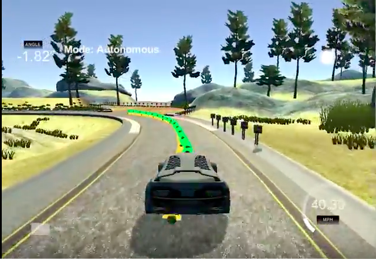
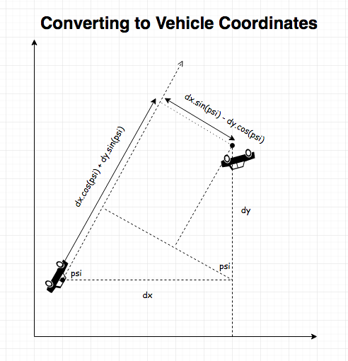

# CarND-Controls-MPC
Self-Driving Car Engineer Nanodegree Program

---
## Project Introduction

The simulator provides us with vehicle's state (current speed, throttle and steering angle) and its location in X-Y co-ordinates and its orientation (psi in radians) with respective to X-axis.
We also get 10 wave points in same co-ordinates system for the vehicle to follow. We are also told that the Vehicle has 100 millisecond latency from command to actuation.

Click on the following video to see the implementation of MPC in action.

 

## Implementation

### Convert way-points to Vehicle coordinate space
The following diagram shows how to convert to vehicle co-ordinates system.
In this system the current position of the car is treated as (0,0) with X axis along the direction of car's motion so psi-vehicle is zero too.
[]

### Fitting 3rd degree polynomial for the waypoints
Third degree polynomial resembles road better so we use the converted way-points to fit a third degree polynomial.

### Solver constraints
We use the CPPAD/ioopt solver. We bound the following variables.
1. x variable is bounded between 0 and x_max where x_max is the x coordinate of the 10th way-point. We reason that there is no point in predicting points beyond what we know of the road.
2. We tried to restrict y between -y_max & +y_max similarly but found it not to be necessary as other constraints worked better.
3. We restricted the steering angle between += 25 degrees (or -+ 0.436332 radians as suggested) to avoid sharp turns. Results show that our car never takes turns beyond +- 0.19
4. We limited the braking to -0.5 to avoid sharp breaks. For acceleration we came with an elegant way to slow down. Normally when we drive the car we don't go full throttle at all speeds so we decide to limit throttle inverse of speed (1-v/v_max) where v_max was set to 100 mph. We see the car going above 70mph and keeping good speed and stability while slowing down at turns.

With some trial & error we settled with N = 15 and dt = .08 for best prediction of car's trajectory.
We also used the following multipliers in cost function to make sure all variables have effect on the cost equally.
1. 1000 for CTE (cross track error).
2. 10000 for EPSI (error in vehicle orientation).
3. 1 for velocity as velocity already has a very high order of magnitude compared to other variables.
4. 100 for steering angle (delta) to reduce use of steering unnecessarily.
5. 10 for acceleration so we can go steady as much as we can.
6. 1 for change in steering angle (delta) between consecutive values (to reduce sudden jerks).
7. 10 for change in acceleration between consecutive values (to reduce sudden jerks).

### Constraints
We setup constraints using these kinematic equations for the model:
* x_[t+1] = x[t] + v[t] * cos(psi[t]) * dt
* y_[t+1] = y[t] + v[t] * sin(psi[t]) * dt
* psi_[t+1] = psi[t] + v[t] / Lf * delta[t] * dt
* v_[t+1] = v[t] + a[t] * dt
* cte[t+1] = f(x[t]) - y[t] + v[t] * sin(epsi[t]) * dt
* epsi[t+1] = psi[t] - psides[t] + v[t] * delta[t] / Lf * dt

### Summary
I think overall I was very pleasantly surprised with how steady the car is compared with PID and other controls. This definitely depend on how good way-points we have though.
I am wondering how can we get way-points for roads that have not been traveled before? Can we look at the camera images and calculate way-points?

-------
# Project setup instructions

## Dependencies

* cmake >= 3.5
 * All OSes: [click here for installation instructions](https://cmake.org/install/)
* make >= 4.1
  * Linux: make is installed by default on most Linux distros
  * Mac: [install Xcode command line tools to get make](https://developer.apple.com/xcode/features/)
  * Windows: [Click here for installation instructions](http://gnuwin32.sourceforge.net/packages/make.htm)
* gcc/g++ >= 5.4
  * Linux: gcc / g++ is installed by default on most Linux distros
  * Mac: same deal as make - [install Xcode command line tools]((https://developer.apple.com/xcode/features/)
  * Windows: recommend using [MinGW](http://www.mingw.org/)
* [uWebSockets](https://github.com/uWebSockets/uWebSockets) == 0.14, but the master branch will probably work just fine
  * Follow the instructions in the [uWebSockets README](https://github.com/uWebSockets/uWebSockets/blob/master/README.md) to get setup for your platform. You can download the zip of the appropriate version from the [releases page](https://github.com/uWebSockets/uWebSockets/releases). Here's a link to the [v0.14 zip](https://github.com/uWebSockets/uWebSockets/archive/v0.14.0.zip).
  * If you have MacOS and have [Homebrew](https://brew.sh/) installed you can just run the ./install-mac.sh script to install this.
* Fortran Compiler
  * Mac: `brew install gcc` (might not be required)
  * Linux: `sudo apt-get install gfortran`. Additionall you have also have to install gcc and g++, `sudo apt-get install gcc g++`. Look in [this Dockerfile](https://github.com/udacity/CarND-MPC-Quizzes/blob/master/Dockerfile) for more info.
* [Ipopt](https://projects.coin-or.org/Ipopt)
  * Mac: `brew install ipopt`
  * Linux
    * You will need a version of Ipopt 3.12.1 or higher. The version available through `apt-get` is 3.11.x. If you can get that version to work great but if not there's a script `install_ipopt.sh` that will install Ipopt. You just need to download the source from the Ipopt [releases page](https://www.coin-or.org/download/source/Ipopt/) or the [Github releases](https://github.com/coin-or/Ipopt/releases) page.
    * Then call `install_ipopt.sh` with the source directory as the first argument, ex: `bash install_ipopt.sh Ipopt-3.12.1`.
  * Windows: TODO. If you can use the Linux subsystem and follow the Linux instructions.
* [CppAD](https://www.coin-or.org/CppAD/)
  * Mac: `brew install cppad`
  * Linux `sudo apt-get install cppad` or equivalent.
  * Windows: TODO. If you can use the Linux subsystem and follow the Linux instructions.
* [Eigen](http://eigen.tuxfamily.org/index.php?title=Main_Page). This is already part of the repo so you shouldn't have to worry about it.
* Simulator. You can download these from the [releases tab](https://github.com/udacity/CarND-MPC-Project/releases).
* Not a dependency but read the [DATA.md](./DATA.md) for a description of the data sent back from the simulator.

## Basic Build Instructions

1. Clone this repo.
2. Make a build directory: `mkdir build && cd build`
3. Compile: `cmake .. && make`
4. Run it: `./mpc`.

## Tips

1. It's recommended to test the MPC on basic examples to see if your implementation behaves as desired. One possible example
is the vehicle starting offset of a straight line (reference). If the MPC implementation is correct, after some number of timesteps
(not too many) it should find and track the reference line.
2. The `lake_track_waypoints.csv` file has the waypoints of the lake track. You could use this to fit polynomials and points and see of how well your model tracks curve. NOTE: This file might be not completely in sync with the simulator so your solution should NOT depend on it.
3. For visualization this C++ [matplotlib wrapper](https://github.com/lava/matplotlib-cpp) could be helpful.

## Editor Settings

We've purposefully kept editor configuration files out of this repo in order to
keep it as simple and environment agnostic as possible. However, we recommend
using the following settings:

* indent using spaces
* set tab width to 2 spaces (keeps the matrices in source code aligned)

## Code Style

Please (do your best to) stick to [Google's C++ style guide](https://google.github.io/styleguide/cppguide.html).

## Project Instructions and Rubric

Note: regardless of the changes you make, your project must be buildable using
cmake and make!

More information is only accessible by people who are already enrolled in Term 2
of CarND. If you are enrolled, see [the project page](https://classroom.udacity.com/nanodegrees/nd013/parts/40f38239-66b6-46ec-ae68-03afd8a601c8/modules/f1820894-8322-4bb3-81aa-b26b3c6dcbaf/lessons/b1ff3be0-c904-438e-aad3-2b5379f0e0c3/concepts/1a2255a0-e23c-44cf-8d41-39b8a3c8264a)
for instructions and the project rubric.

## Hints!

* You don't have to follow this directory structure, but if you do, your work
  will span all of the .cpp files here. Keep an eye out for TODOs.

## Call for IDE Profiles Pull Requests

Help your fellow students!

We decided to create Makefiles with cmake to keep this project as platform
agnostic as possible. Similarly, we omitted IDE profiles in order to we ensure
that students don't feel pressured to use one IDE or another.

However! I'd love to help people get up and running with their IDEs of choice.
If you've created a profile for an IDE that you think other students would
appreciate, we'd love to have you add the requisite profile files and
instructions to ide_profiles/. For example if you wanted to add a VS Code
profile, you'd add:

* /ide_profiles/vscode/.vscode
* /ide_profiles/vscode/README.md

The README should explain what the profile does, how to take advantage of it,
and how to install it.

Frankly, I've never been involved in a project with multiple IDE profiles
before. I believe the best way to handle this would be to keep them out of the
repo root to avoid clutter. My expectation is that most profiles will include
instructions to copy files to a new location to get picked up by the IDE, but
that's just a guess.

One last note here: regardless of the IDE used, every submitted project must
still be compilable with cmake and make./
